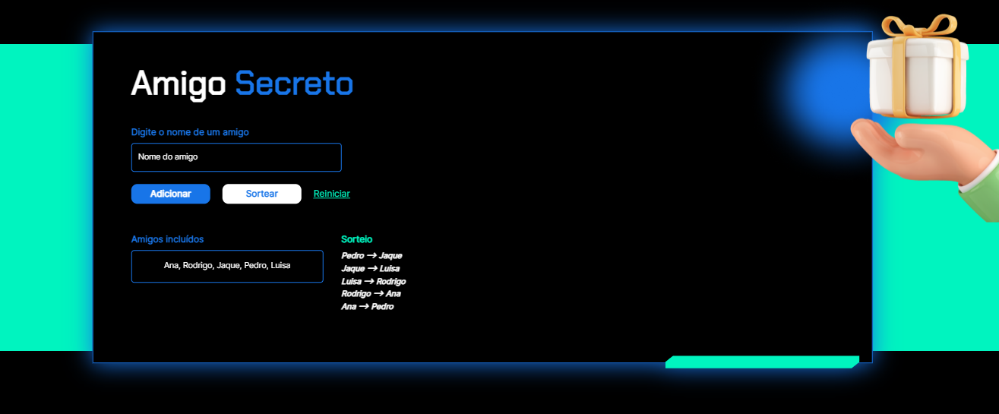

  

## 💻 Tecnologias

Esse projeto foi desenvolvido com as seguintes tecnologias:

- HTML
- CSS
- JavaScript

## 💻 Projeto

Este é um projeto simples para organizar um Amigo Secreto.

O projeto consiste em uma página web onde você pode adicionar nomes de amigos para participar do Amigo Secreto e depois sortear quem será o amigo de quem. Também há a opção de reiniciar o sorteio.

